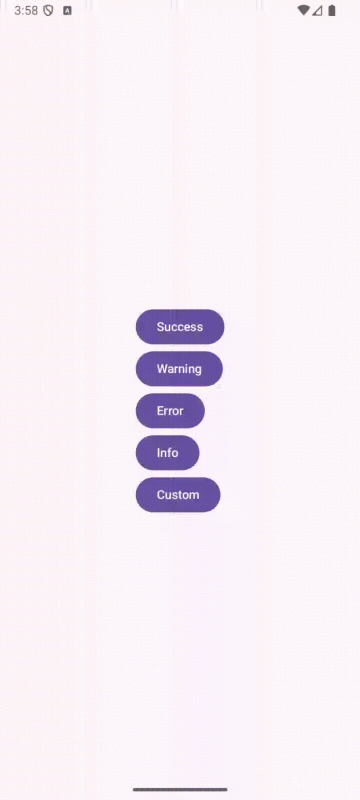

# 📦 Compose CrossMessages

**Compose CrossMessages** is a simple and lightweight library for displaying messages across Android
and iOS using Jetpack Compose Multiplatform (KMP).  
It currently supports:

- ✅ Custom **Snackbar** UI for Compose-based apps
- ✅ Native **Alert Dialogs** using platform-specific APIs:
    - `AlertDialog` on Android
    - `UIAlertController` on iOS

---

## ✨ Features

- Cross-platform message handling with shared API
- Snackbar supports:
    - Custom actions
    - Duration control
    - Queued messages
- Native alerts on both platforms
- Designed for **KMP-first** projects (uses `expect/actual`)

---

## 📸 Screenshots

| Android Snackbar                                        | iOS Native Alert                          |
|---------------------------------------------------------|-------------------------------------------|
|  |  |

---

## 🚀 Getting Started

### 1. Add Dependency

### Gradle (Kotlin DSL)

```kotlin
dependencies {
    implementation("com.berkaykirecci:snackbar:$version")
}
```

---

### 2. Example Usages

#### 📍 Show Snackbar Messages

#### 🔹 Default Types

```kotlin
val state = rememberSnackbarState()

state.show(SnackbarDefaults.success("Success Message"))
state.show(SnackbarDefaults.warning("Warning Message"))
state.show(SnackbarDefaults.error("Error Message"))
state.show(SnackbarDefaults.info("Info Message"))
```

#### 🔹 Fully Customized Snackbar
```kotlin
state.show(
    SnackbarModel(
        message = "Custom Message",
        backgroundColor = Color.Black,
        duration = 3000L,
        showActionButton = true,
        actionButtonModel = ActionButtonModel(
            iconRes = Res.drawable.action_btn,
            onActionClick = { }
        ),
        leadingIconModel = LeadingIconModel(
            iconRes = Res.drawable.icon,
            iconTint = Color.LightGray,
            iconSize = 18.dp
        ),
        textModel = TextModel(
            textColor = Color.Yellow,
            textAlignment = TextAlign.Center
        ),
        alignment = Alignment.TopCenter
    )
)
```
#### 🎞️ Demo




---

#### 📍 Show Native Alert

```kotlin
@Composable
fun App() {
    NativeAlert(
        message = "Warning",
        title = "This is a warning message!",
        actions = listOf(
            Action("Ok", ActionStyle.DEFAULT),
            Action("Cancel", ActionStyle.CANCEL)
        )
    )
}
```

---

## 📄 License

```
Copyright 2015 Square, Inc.

Licensed under the Apache License, Version 2.0 (the "License");
you may not use this file except in compliance with the License.
You may obtain a copy of the License at

http://www.apache.org/licenses/LICENSE-2.0

Unless required by applicable law or agreed to in writing, software
distributed under the License is distributed on an "AS IS" BASIS,
WITHOUT WARRANTIES OR CONDITIONS OF ANY KIND, either express or implied.
See the License for the specific language governing permissions and 
limitations under the License.
```

---

## 👋 Contributing

Pull requests and issues are welcome!