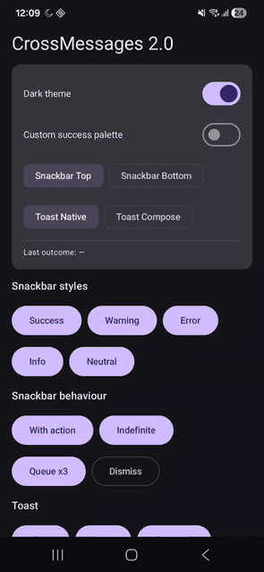
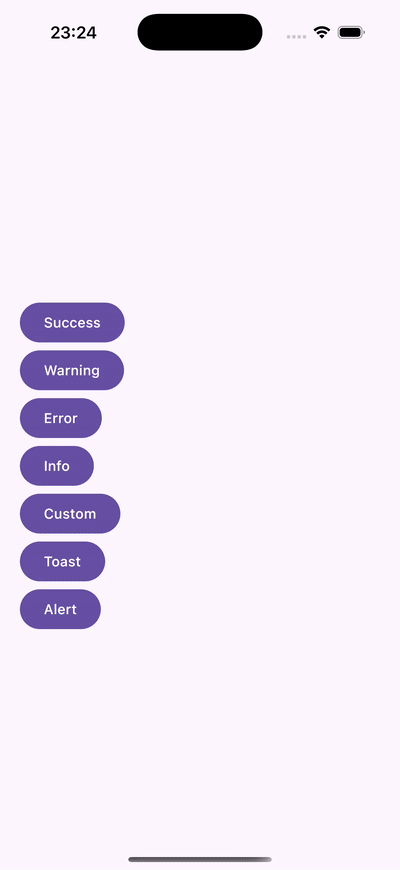

# 📦 Compose CrossMessages

**Compose CrossMessages** is a simple and lightweight library for displaying messages across Android
and iOS using Jetpack Compose Multiplatform (KMP).  
It currently supports:

- ✅ Custom **Snackbar** UI for Compose-based apps
- ✅ Native **Toast Messages** and **Alert Dialogs** using platform-specific APIs:
    - `AlertDialog` on Android
    - `UIAlertController` on iOS

---

## ✨ Features

- Cross-platform message handling with shared API
- Snackbar supports:
    - Custom actions
    - Duration control
    - Queued messages
- Native toast messages and alerts on both platforms
- Designed for **KMP-first** projects

---

## 🎞️ Demo

<p align="center">
  
  &nbsp;
  
</p>

---

## 🚀 Getting Started

### 1. Add Dependency

### Gradle (Kotlin DSL)

```kotlin
dependencies {
    implementation("io.github.berkaykirecci:crossmesages:$version")
}
```

---

### 2. Example Usages

#### 📍 Show Snackbar Messages

#### 🔹 Default Types

```kotlin
val snackbarState = rememberSnackbarState()
MultiPlatformSnackbar(state = snackbarState)

snackbarState.show(SnackbarDefaults.success("Success Message"))
snackbarState.show(SnackbarDefaults.warning("Warning Message"))
snackbarState.show(SnackbarDefaults.error("Error Message"))
snackbarState.show(SnackbarDefaults.info("Info Message"))
```

#### 🔹 Fully Customized Snackbar

```kotlin
snackbarState.show(
    SnackbarModel(
        message = "Custom Message",
        backgroundColor = Color.Black,
        duration = 3000L,
        showActionButton = true,
        actionButtonModel = ActionButtonModel(
            iconRes = Res.drawable.action_btn,
            onActionClick = { }
        ),
        leadingIconModel = LeadingIconModel(
            iconRes = Res.drawable.icon,
            iconTint = Color.LightGray,
            iconSize = 18.dp
        ),
        textModel = TextModel(
            textColor = Color.Yellow,
            textAlignment = TextAlign.Center
        ),
        alignment = Alignment.TopCenter
    )
)
```

#### 📍 Show Toast Messages

```kotlin
val toastState = rememberToastState()
Toast(state = toastState)

toastState.show("Toast Message")
```

---

#### 📍 Show Native Alert

```kotlin
val alertState = rememberAlertState()
Alert(state = alertState)

alertState.show(
    AlertModel(
        message = "Alert Message",
        title = "Alert Title",
        actions = listOf(
            DialogAction("Ok", ActionStyle.DEFAULT),
            DialogAction("Cancel", ActionStyle.CANCEL)
        )
    )
)
```

---

## 📄 License

```
Copyright 2015 Square, Inc.

Licensed under the Apache License, Version 2.0 (the "License");
you may not use this file except in compliance with the License.
You may obtain a copy of the License at

http://www.apache.org/licenses/LICENSE-2.0

Unless required by applicable law or agreed to in writing, software
distributed under the License is distributed on an "AS IS" BASIS,
WITHOUT WARRANTIES OR CONDITIONS OF ANY KIND, either express or implied.
See the License for the specific language governing permissions and 
limitations under the License.
```

---

## 👋 Contributing

Pull requests and issues are welcome!